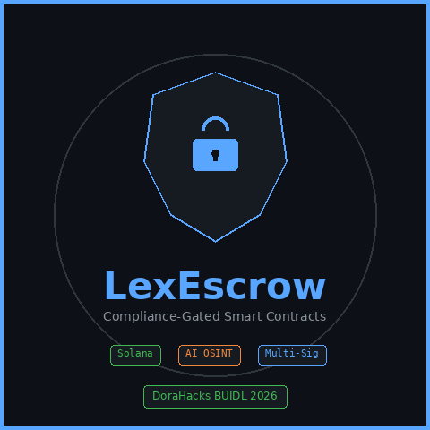

# LexEscrow

> **Compliance-Gated Smart Contracts for Legal Escrow**
>
> On-chain fund custody with AI-powered regulatory screening, multi-sig approval workflows, and immutable compliance attestations — built for large law firms on Solana.

<p align="center">
  
</p>

<p align="center">
  <strong>BUIDL Legal Hack 2026</strong> · DoraHacks · BLI Track
</p>

---

## 🎯 Vision

Cross-border legal settlements — M&A closings, litigation payouts, fund formations — move trillions of dollars annually, yet the final compliance check before fund release is still manual, static, and unauditable. A sanctions list can update between the time a law firm completes its KYC review and the moment the wire transfer executes. When that happens, the firm faces regulatory liability with no immutable proof that due diligence was performed.

**LexEscrow solves this by making compliance a non-negotiable, on-chain gate.** Funds are locked in a Solana smart contract. When legal counsel approves release, the contract pauses and triggers an AI-powered compliance oracle that screens the receiving entity against OFAC SDN, PEP databases, AML keyword registries, and real-time OSINT signals. Only after a **CLEARED** attestation is minted on-chain do the funds release. If any risk is detected, the transaction is hard-blocked — permanently and transparently.

This gives large law firms what they've never had: **an immutable, real-time compliance checkpoint** at the exact moment of fund movement, with a permanent on-chain audit trail that regulators can verify.

---

## 🏗️ How It Works

```
┌──────────────┐    ┌───────────────────┐    ┌───────────────────┐
│  Law Firm    │───>│  Solana Escrow    │───>│  Compliance       │
│  Dashboard   │    │  Smart Contract   │    │  Oracle           │
│  (Next.js)   │<───│  (Anchor/Rust)    │<───│  (FastAPI/Tavily) │
└──────────────┘    └───────────────────┘    └───────────────────┘
                           │                         │
                    Multi-Sig Approval       AI OSINT Sweep
                    On-Chain Attestation     OFAC/PEP/AML Check
                    PDA Vault Custody        Weighted Risk Score
```

**Fund Release Flow:**

```
Created → Approved (Multi-Sig) → PendingCompliance → CLEARED/BLOCKED → Released/Blocked
                                       │
                              ┌────────┴────────┐
                              │  Event Listener  │
                              │  (WebSocket)     │
                              └────────┬────────┘
                                       │
                              ┌────────┴────────┐
                              │  AI Compliance  │
                              │  Oracle         │
                              └────────┬────────┘
                                       │
                              ┌────────┴────────┐
                              │  On-Chain       │
                              │  Attestation    │
                              └─────────────────┘
```

---

## ⚡ Smart Contract (Anchor / Rust)

| Instruction | Description |
|-------------|-------------|
| `create_escrow` | Lock SOL in a PDA-derived vault with depositor, recipient, and approvers |
| `approve_release` | Multi-sig approval — second approval transitions to `PendingCompliance` |
| `submit_attestation` | Compliance oracle submits `CLEARED` or `BLOCKED` result on-chain |
| `release_funds` | Transfers SOL from PDA vault to recipient via `invoke_signed` (requires CLEARED) |
| `cancel_escrow` | Depositor-only cancellation with full refund |

**On-Chain Events:** `EscrowCreated` · `ReleaseApproved` · `ComplianceCheckRequested` · `ComplianceAttestationMinted` · `FundsReleased` · `EscrowCancelled`

### Test Suite

5-test integration suite covering the full lifecycle: create → first approval → second approval → CLEARED attestation → fund release.

```bash
cd programs/lexescrow
anchor build
anchor test
```

---

## 🤖 Compliance Oracle (FastAPI / Python)

Real-time entity screening with weighted risk scoring:

| Check | Weight | Source |
|-------|--------|--------|
| OFAC SDN | 40% | US Treasury API |
| PEP Screening | 25% | Political exposure databases |
| AML Keywords | 20% | Transaction pattern analysis |
| AI OSINT | 15% | Tavily web search |

Entities scoring **below 50** receive `CLEARED`; **50+** is `BLOCKED`. Results are SHA-256 hashed and submitted as on-chain attestations.

```bash
cd compliance-oracle
export TAVILY_API_KEY="tvly-your-key"
python3 main.py  # http://localhost:8001
```

---

## 📡 Event Listener (Node.js / WebSocket)

Subscribes to Solana logs for `EscrowApproved` events. When detected, automatically calls the compliance oracle and submits the attestation back on-chain — fully autonomous, zero human intervention.

```bash
cd event-listener
export PROGRAM_ID="<deployed-program-id>"
export ORACLE_URL="http://localhost:8001"
node index.js
```

---

## 📊 Matter Management Dashboard (Next.js)

Legal-ops-friendly UI showing active escrows, real-time status tracking, one-click attestation submission, and matter details — built for large law firm teams, not crypto natives.

```bash
cd dashboard
npm install && npm run dev  # http://localhost:3000
```

---

## 🛠️ Tech Stack

| Layer | Technology |
|-------|-----------|
| Smart Contract | Solana · Anchor 0.30.0 · Rust |
| Compliance | FastAPI · Python · Tavily AI OSINT |
| Event Processing | Node.js · Solana WebSocket Subscription |
| Frontend | Next.js · React · Tailwind CSS |
| Security | PDA-derived vaults · Multi-sig · SHA-256 attestations |
| Deployment | Solana Devnet · `cargo build-sbf` |

---

## 🚀 Quick Start

```bash
# 1. Clone
 git clone https://github.com/icohangar-ops/lexescrow.git && cd lexescrow

# 2. Smart Contract
 cd programs/lexescrow && anchor build && anchor test

# 3. Compliance Oracle
 cd ../../compliance-oracle && pip install -r requirements.txt
 export TAVILY_API_KEY="tvly-..." && python3 main.py

# 4. Dashboard
 cd ../dashboard && npm install && npm run dev
```

See [DEPLOY.md](DEPLOY.md) for full deployment instructions to Solana devnet.

---

## 📂 Repository Structure

```
lexescrow/
├── programs/lexescrow/       # Anchor smart contract (Rust)
│   ├── src/lib.rs            # Core escrow logic + compliance gate
│   ├── tests/lexescrow.ts    # 5-test integration suite
│   └── Cargo.toml
├── compliance-oracle/        # FastAPI compliance oracle
│   ├── main.py               # Tavily OSINT + weighted risk scoring
│   └── test_oracle.py        # Offline mock tests
├── event-listener/            # Solana log subscription
│   └── index.js              # EscrowApproved event → oracle → attestation
├── dashboard/                 # Next.js Matter Management UI
│   └── src/app/page.tsx      # Active escrows table + attestation modal
├── assets/
│   ├── logo.png              # BUIDL logo (480x480)
│   ├── thumbnail.png         # Submission thumbnail (1280x720)
│   └── lexescrow_demo.mp4    # 3.4-min demo video (1920x1080)
├── deploy.sh                 # One-click devnet deployment
├── DEPLOY.md                 # Deployment guide
├── Anchor.toml
└── .env.example
```

---

## 🏆 Why LexEscrow Wins

| Hackathon Criterion | LexEscrow's Approach |
|---------------------|---------------------|
| **Blockchain** | Immutable on-chain escrow with PDA-derived vaults; compliance attestations are permanent, verifiable proof on Solana |
| **Finance** | Real SOL custody with multi-sig milestone gates; actual fund movement, not just tokenization |
| **Compliance** | AI-powered real-time OFAC/PEP/AML screening via Tavily OSINT — not a static database check, but a live sweep at the moment of release |
| **Large Law Firms** | Dashboard uses legal ops language ("Matters," "Attestations," "Compliance Status") — no crypto jargon, no wallet requirements for end users |

---

## 📜 License

MIT
